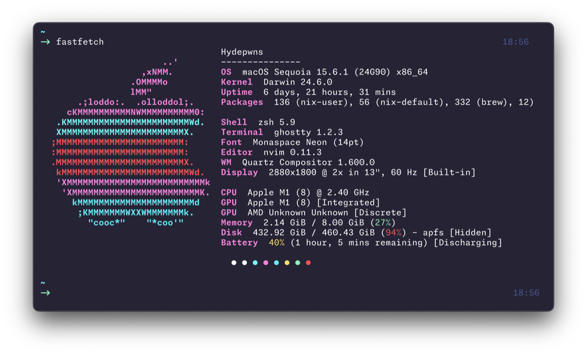

# DROO's Dotfiles

[](LICENSE)
[](https://github.com/Hydepwns/dotfiles)
[](home/dot_zshrc.tmpl)
[](Makefile)

Cross-platform dotfiles managed with [chezmoi](https://chezmoi.io) - featuring modular zsh, unified Synthwave84 theming, terminal power tools, and secrets management.

<p align="center">
  
</p>

## Quick Start

```bash
# Full bootstrap (installs everything)
curl -fsSL https://raw.githubusercontent.com/Hydepwns/dotfiles/main/scripts/install/remote-bootstrap.sh | bash

# Minimal install
brew install chezmoi && chezmoi init --apply https://github.com/Hydepwns/dotfiles.git
```

## What's Included

| Category | Tools |
|----------|-------|
| **Terminal** | Ghostty, tmux (Synthwave84 themed) |
| **Editors** | Zed, Neovim (27 plugins, mona.nvim theme) |
| **Shell** | Zsh + Starship + fzf + zoxide |
| **CLI Tools** | eza, bat, fd, ripgrep, delta, jq, yq |
| **File Manager** | yazi with image/PDF/archive preview |
| **System** | btop (Synthwave84), fastfetch, tldr (`help`) |
| **Window Mgmt** | Hammerspoon + PaperWM (macOS) |
| **Launcher** | Raycast (macOS, `config/raycast/`) |
| **AI** | Claude Code, takopi (Telegram bridge) |
| **Secrets** | 1Password + age encryption, AWS CLI, Infisical |
| **Network** | Tailscale with pre-configured hosts |
| **Languages** | Elixir, Rust, Go, Python, Node.js, Lua (via mise) |
| **Fonts** | Monaspace + Nerd Font |

## Terminal Power Tools

| Tool | Replaces | Key Binding / Alias |
|------|----------|---------------------|
| fzf | - | `Ctrl+R` history, `Ctrl+T` files, `Alt+C` cd |
| zoxide | cd | `z` - smart jump (`z proj` -> `/path/to/project`) |
| eza | ls | `ls`, `ll`, `la`, `lt` - icons + git status |
| bat | cat | `cat` - syntax highlighting + man pager |
| fd | find | `find` - faster, respects .gitignore |
| ripgrep | grep | `grep`, `rg` - faster search |
| delta | diff | Git diffs with syntax highlighting |
| yazi | - | `y` - terminal file manager with preview |
| btop | htop | `top`, `htop` - system monitor (Synthwave84) |
| fastfetch | neofetch | `fetch` - system info display |
| jq / yq | - | JSON and YAML processing |
| tldr | man | `help` - simplified command examples |

## Key Bindings

### Hammerspoon (macOS)

PaperWM scrollable tiling (set `paperwm = true` in chezmoi.toml, `make setup-paperwm`):

| Key | Action |
|-----|--------|
| `Cmd+Alt + hjkl` | Focus left/right/down/up |
| `Cmd+Alt+Shift + hjkl` | Swap windows |
| `Cmd+Alt + r` | Cycle width (1/3, 1/2, 2/3) |
| `Cmd+Alt + return` | Full width |
| `Cmd+Alt + c` | Center window |
| `Cmd+Alt + i/o` | Slurp/barf columns |
| `Cmd+Alt+Shift + space` | Toggle floating |
| `Cmd+Alt + 1-9` | Switch space |
| `Cmd+Alt + t` | Ghostty |
| `Cmd+Alt + e` | Zed |
| `Cmd+Alt + b` | Brave Browser |
| `Cmd+Alt + space` | App chooser |
| `Cmd+Alt + v` | Clipboard history |
| `Hyper + q` | Lock screen |

### tmux

| Key | Action |
|-----|--------|
| `Ctrl+a` | Prefix (instead of Ctrl+b) |
| `\|` | Split horizontal |
| `-` | Split vertical |
| `hjkl` | Navigate panes |
| `Shift + arrows` | Switch windows |

### Neovim

| Key | Action |
|-----|--------|
| `Space + ff` | Find files (Telescope) |
| `Space + fg` | Live grep |
| `Space + e` | File explorer |
| `s` | Flash jump |
| `gd` | Go to definition |

## Commands

```bash
# Chezmoi
make install          # Fresh install
make update           # Pull and apply remote
chezmoi apply         # Apply local changes

# Tools
make brew-install     # Install Brewfile packages
make lint             # Run shellcheck on all scripts
make setup-secrets    # Install 1Password, AWS, Infisical, Tailscale
make setup-paperwm    # Install PaperWM.spoon for Hammerspoon
make raycast-export   # Export Raycast settings to dotfiles
make raycast-import   # Import Raycast settings from dotfiles
make setup-takopi     # Install takopi via uv
make takopi-onboard   # Interactive takopi setup wizard
make dashboard        # Service status dashboard

# SSH
make rotate-keys      # Generate, store in 1Password, sync to hosts
make sync-keys        # Sync public key to Tailscale nodes
```

## Secrets Management

| Provider | Purpose | Quick Commands |
|----------|---------|----------------|
| **1Password** | Primary secrets, SSH agent | `opl`, `opw` |
| **AWS CLI** | Cloud credentials | `awsw`, `aws-profile` |
| **Infisical** | Backup secrets | `infl`, `inf-env` |

## Configuration

Edit `~/.config/chezmoi/chezmoi.toml`:

```toml
[data]
starship = true
paperwm = true
raycast = true
takopi = true
tailscale = true
onepassword = true
aws = true
elixir = true
mise = true
```

## Directory Structure

```
dotfiles/
├── home/
│   ├── dot_zsh/                    # Modular zsh
│   │   ├── core/tools.zsh.tmpl     # fzf/zoxide/eza/bat + completions
│   │   ├── core/lazy-loading.zsh.tmpl  # mise, direnv
│   │   ├── aliases/dev.zsh         # Shell aliases
│   │   └── functions/              # Shell functions
│   ├── dot_hammerspoon/            # Window management (PaperWM)
│   ├── dot_tmux.conf.tmpl          # Modern tmux
│   ├── private_dot_config/
│   │   ├── ghostty/                # Terminal
│   │   ├── zed/                    # Editor
│   │   ├── nvim/                   # Neovim (27 plugins)
│   │   ├── btop/                   # System monitor + theme
│   │   ├── yazi/                   # File manager + theme
│   │   ├── fastfetch/              # System info
│   │   ├── starship/               # Prompt config
│   │   └── direnv/                 # direnv layouts (mise, poetry)
│   ├── dot_takopi/                 # takopi config (encrypted)
│   └── dot_claude/                 # Claude Code prefs
├── config/
│   ├── raycast/                    # Raycast settings export
│   └── theme/synthwave84.toml      # Theme source of truth
├── Brewfile                        # macOS packages (auto-installs on apply)
└── scripts/
    ├── setup/                      # Installation
    └── utils/                      # Maintenance
```

## Theming

Unified Synthwave84 theme across all tools:
- Ghostty terminal
- tmux status bar
- fzf colors
- Neovim colorscheme (mona.nvim)
- btop system monitor
- yazi file manager
- fastfetch system info
- Starship prompt
- Hammerspoon alerts

Source: `config/theme/synthwave84.toml`

## Fork This Repo

This repo is designed to be forked. On first `chezmoi init`, you'll be prompted for your name, email, and GitHub username -- all configs adapt automatically.

```bash
# 1. Fork on GitHub, then:
brew install chezmoi
chezmoi init --apply https://github.com/YOUR_USERNAME/dotfiles.git

# 2. chezmoi prompts for your identity on first run:
#    Display name:    Jane Doe
#    Email address:   jane@example.com
#    GitHub username: janedoe
#    Age public key:  (Enter to skip)

# 3. Toggle features in ~/.config/chezmoi/chezmoi.toml:
#    paperwm = true, tailscale = true, etc.

# 4. Apply changes:
chezmoi apply
```

What adapts: git config, shell environment, SSH keys, encrypted secrets, setup scripts, and Makefile targets all read from your chezmoi data or `scripts/utils/constants.sh`.

## Related

- [nix-mox](https://github.com/Hydepwns/nix-mox) - Nix Home Manager configuration
- [synthwave84-zed](https://github.com/Hydepwns/synthwave84-zed) - Synthwave84 theme for Zed
- [mona.nvim](https://github.com/Hydepwns/mona.nvim) - Synthwave84 Neovim colorscheme

---

[chezmoi]: https://chezmoi.io
