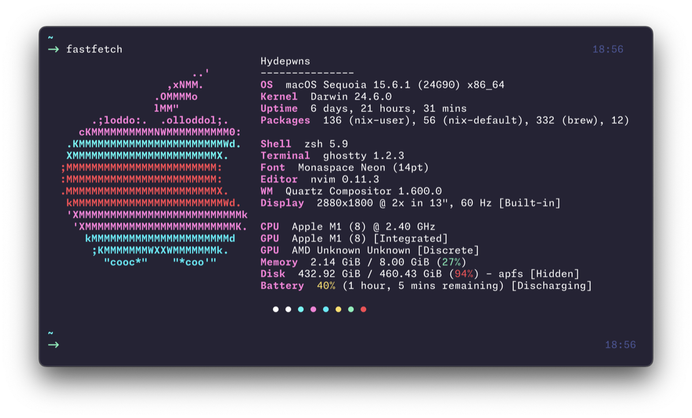

# DROO's Dotfiles

[](LICENSE)
[](https://github.com/DROOdotFOO/dotfiles)
[](home/dot_zshrc.tmpl)
[](Makefile)

My dotfiles. Managed with [chezmoi](https://chezmoi.io), themed in Synthwave84, built around zsh with ~386ms startup. Runs on macOS (Apple Silicon) with Linux support.

<p align="center">
  
</p>

## Quick Start

```bash
# Full bootstrap
curl -fsSL https://raw.githubusercontent.com/DROOdotFOO/dotfiles/main/scripts/install/remote-bootstrap.sh | bash

# Or just the basics
brew install chezmoi && chezmoi init --apply https://github.com/DROOdotFOO/dotfiles.git
```

## What's In Here

| Category      | Tools                                                              |
| ------------- | ------------------------------------------------------------------ |
| **Terminal**  | Ghostty, tmux                                                      |
| **Editors**   | Zed, Neovim (27 plugins, mona.nvim)                                |
| **Shell**     | Zsh + Starship + fzf + zoxide                                      |
| **CLI**       | eza, bat, fd, ripgrep, delta, jq, yq                               |
| **Files**     | yazi with image/PDF/archive preview                                |
| **System**    | btop, fastfetch, tldr (`help`)                                     |
| **Windows**   | Hammerspoon + PaperWM (macOS)                                      |
| **Launcher**  | Raycast (macOS)                                                    |
| **AI**        | Claude Code (custom skills, MCP servers), takopi (Telegram bridge) |
| **Secrets**   | 1Password (SSH agent + age encryption), AWS CLI, Infisical         |
| **Network**   | Tailscale with pre-configured hosts                                |
| **Languages** | Elixir, Rust, Go, Python, Node.js, Lua (via mise)                  |
| **Fonts**     | Monaspace + Nerd Font                                              |

## Terminal Tools

Everything's aliased to feel native. `ls` is eza, `cat` is bat, `grep` is ripgrep.

| Tool      | Replaces | Alias / Binding                              |
| --------- | -------- | -------------------------------------------- |
| fzf       | -        | `Ctrl+R` history, `Ctrl+T` files, `Alt+C` cd |
| zoxide    | cd       | `z proj` jumps to `/path/to/project`         |
| eza       | ls       | `ls`, `ll`, `la`, `lt` -- icons + git status |
| bat       | cat      | `cat` -- syntax highlighting, man pager      |
| fd        | find     | `find` -- faster, respects .gitignore        |
| ripgrep   | grep     | `grep`, `rg`                                 |
| delta     | diff     | Git diffs with syntax highlighting           |
| yazi      | -        | `y` -- file manager with preview             |
| btop      | htop     | `top`, `htop`                                |
| fastfetch | neofetch | `fetch`                                      |
| jq / yq   | -        | JSON and YAML processing                     |
| tldr      | man      | `help` -- short command examples             |

## Key Bindings

### Hammerspoon (macOS)

PaperWM tiling -- enable with `paperwm = true` in chezmoi.toml, then `make setup-paperwm`.

| Key                     | Action                      |
| ----------------------- | --------------------------- |
| `Cmd+Alt + hjkl`        | Focus left/right/down/up    |
| `Cmd+Alt+Shift + hjkl`  | Swap windows                |
| `Cmd+Alt + r`           | Cycle width (1/3, 1/2, 2/3) |
| `Cmd+Alt + return`      | Full width                  |
| `Cmd+Alt + c`           | Center window               |
| `Cmd+Alt + i/o`         | Slurp/barf columns          |
| `Cmd+Alt+Shift + space` | Toggle floating             |
| `Cmd+Alt + 1-9`         | Switch space                |
| `Cmd+Alt + t`           | Ghostty                     |
| `Cmd+Alt + e`           | Zed                         |
| `Cmd+Alt + b`           | Brave                       |
| `Cmd+Alt + space`       | App chooser                 |
| `Cmd+Alt + v`           | Clipboard history           |
| `Hyper + q`             | Lock screen                 |

### tmux

| Key              | Action              |
| ---------------- | ------------------- |
| `Ctrl+a`         | Prefix (not Ctrl+b) |
| `\|`             | Split horizontal    |
| `-`              | Split vertical      |
| `hjkl`           | Navigate panes      |
| `Shift + arrows` | Switch windows      |

### Neovim

| Key          | Action                 |
| ------------ | ---------------------- |
| `Space + ff` | Find files (Telescope) |
| `Space + fg` | Live grep              |
| `Space + e`  | File explorer          |
| `s`          | Flash jump             |
| `gd`         | Go to definition       |

## Commands

```bash
# Chezmoi
make install          # Fresh machine setup
make update           # Pull remote + apply
chezmoi apply         # Apply local changes

# Tools
make brew-install     # Install Brewfile packages
make lint             # Shellcheck everything
make doctor           # 32-point health check
make setup-secrets    # 1Password, AWS, Infisical, Tailscale
make setup-paperwm    # PaperWM.spoon for Hammerspoon
make dashboard        # Service status overview

# SSH
make rotate-keys      # Generate, store in 1Password, sync to hosts
make sync-keys        # Push public key to Tailscale nodes

# Claude Code
make skills-status    # Show installed AI coding skills
```

## Secrets

No plaintext secrets on disk. SSH keys and the age decryption key live in 1Password.

| Provider      | What it does                      | Aliases               |
| ------------- | --------------------------------- | --------------------- |
| **1Password** | SSH agent, age key, secrets vault | `opl`, `opw`          |
| **AWS CLI**   | Cloud credentials                 | `awsw`, `aws-profile` |
| **Infisical** | Backup secrets                    | `infl`, `inf-env`     |

**SSH**: 1Password's SSH agent handles keys on macOS. No `~/.ssh/id_*` files needed. Enable it in 1Password under Settings > Developer > "Use the SSH Agent".

**Age encryption**: Encrypted files (SSH config, shell secrets, takopi config) are decrypted via a wrapper script that pulls the key from 1Password at runtime. On machines without 1Password, chezmoi falls back to `~/.config/chezmoi/age_key.txt`.

## Configuration

Toggle features in `~/.config/chezmoi/chezmoi.toml`:

```toml
[data]
starship = true
paperwm = true
raycast = true
takopi = true
tailscale = true
onepassword = true
aws = true
elixir = true
mise = true
```

Then `chezmoi apply` to pick up the changes.

## Directory Layout

```
dotfiles/
├── home/
│   ├── dot_zsh/                        # Modular zsh
│   │   ├── core/tools.zsh.tmpl         # fzf/zoxide/eza/bat + completions
│   │   ├── core/lazy-loading.zsh.tmpl  # mise, direnv
│   │   ├── aliases/dev.zsh             # Shell aliases
│   │   └── functions/                  # Shell functions
│   ├── dot_hammerspoon/                # Window management (PaperWM)
│   ├── dot_tmux.conf.tmpl             # tmux config
│   ├── private_dot_config/
│   │   ├── ghostty/                    # Terminal
│   │   ├── zed/                        # Editor
│   │   ├── nvim/                       # Neovim (27 plugins)
│   │   ├── btop/                       # System monitor
│   │   ├── yazi/                       # File manager
│   │   ├── fastfetch/                  # System info
│   │   ├── starship/                   # Prompt
│   │   └── direnv/                     # direnv layouts
│   ├── .chezmoiexternal.toml           # External deps (agent-skills repo)
│   ├── dot_takopi/                     # takopi config (encrypted)
│   └── private_dot_claude/             # Claude Code config + hooks
├── config/
│   ├── raycast/                        # Raycast settings
│   └── theme/synthwave84.toml          # Theme colors
├── Brewfile                            # Packages (auto-installs on apply)
└── scripts/
    ├── setup/                          # Setup scripts
    └── utils/                          # Health checks, dashboards, etc.
```

## Theming

Everything runs Synthwave84. The palette lives in `config/theme/synthwave84.toml` and gets templated into Ghostty, tmux, fzf, Neovim (mona.nvim), btop, yazi, fastfetch, Starship, and Hammerspoon.

## Forking

This is meant to be forked. On first `chezmoi init`, you get prompted for your name, email, and GitHub username. Everything adapts from there -- git config, SSH, encrypted secrets, the works.

```bash
# Fork on GitHub, then:
brew install chezmoi
chezmoi init --apply https://github.com/YOUR_USERNAME/dotfiles.git

# chezmoi asks for your identity:
#   Display name:    Jane Doe
#   Email address:   jane@example.com
#   GitHub username: janedoe
#   Age public key:  (Enter to skip)

# Toggle what you want in ~/.config/chezmoi/chezmoi.toml, then:
chezmoi apply
```

## TODO

- [x] Add Zig skill to droo-stack (zmin, cross-platform bindings)
- [x] Add C skill to droo-stack (tree-sitter grammars, NIFs)
- [x] Add Nix skill (language, flakes, NixOS, Home Manager, agent integration)
- [ ] Add Java skill to droo-stack (RuneLite plugin development)

## Related

- [nix-mox](https://github.com/DROOdotFOO/nix-mox) -- Nix Home Manager config
- [synthwave84-zed](https://github.com/DROOdotFOO/synthwave84-zed) -- Synthwave84 for Zed
- [mona.nvim](https://github.com/DROOdotFOO/mona.nvim) -- Synthwave84 for Neovim

---

[chezmoi]: https://chezmoi.io
